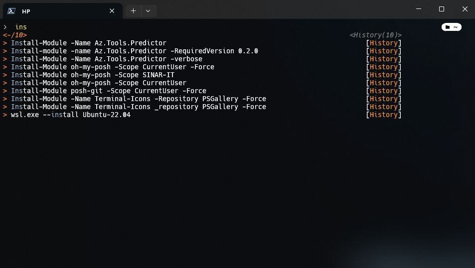

<h1 align="center">
⚡️Minimal Terminal Setup
</h1>

<h4 align="center">


</h4>

A stylish and functional PowerShell profile that looks and feels almost as good as a Linux terminal.



## 📦 One Line Install (Elevated PowerShell Recommended)

Execute the following command in an elevated PowerShell window to install the PowerShell profile:

> [!WARNING]  
> Run Powershell As Administrator.

```powershell
irm "https://github.com/tejasholla/powershell-profile/raw/main/setup.ps1" | iex
```

## Activity


## 🛠️ Fix the Missing Font

After running the script, you'll find a downloaded `cove.zip` file in the folder you executed the script from. Follow these steps to install the required nerd fonts:

1. Extract the `cove.zip` file.
2. Locate and install the nerd fonts.

## Customize this profile

**Do not make any changes to the `Microsoft.PowerShell_profile.ps1` file**, since it's hashed and automatically overwritten by any commits to this repository.
After the profile is installed and active, run the `Edit-Profile` function to create a separate profile file for your current user.

## License

This project is licensed under the MIT License. See the LICENSE file for details.

---

**_Remember, with great power comes great responsibility. Use these spells wisely, and let the magic unfold!_**

Now, enjoy your enhanced and stylish PowerShell experience! 🚀
